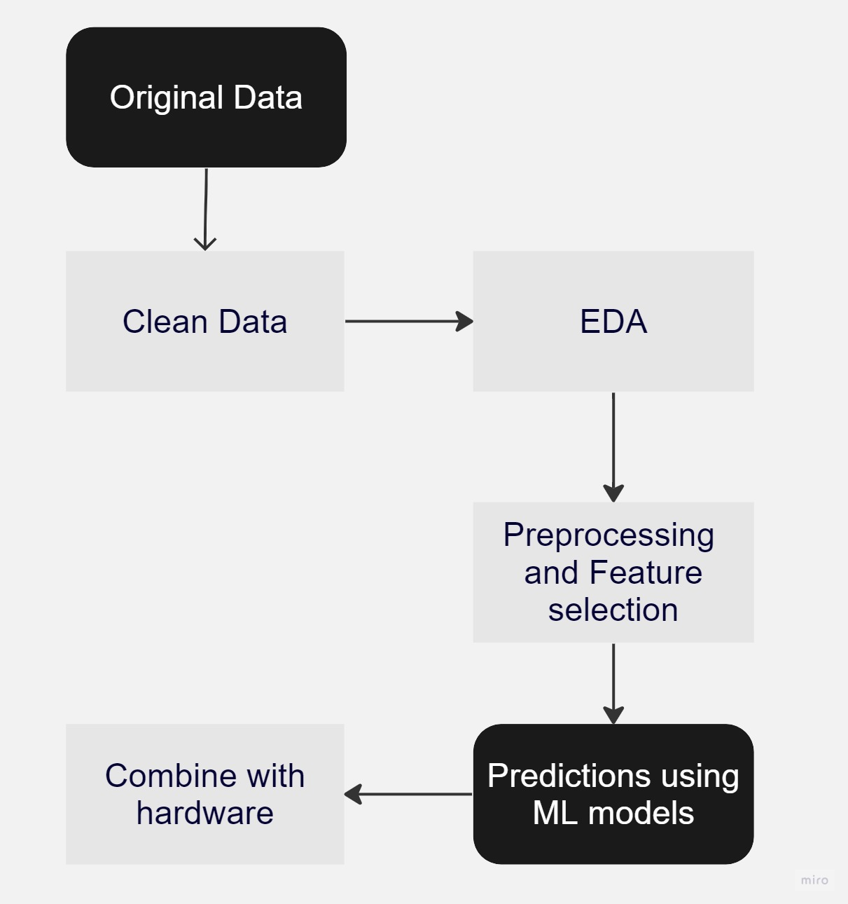

# Traffic Prediction using ML and 4 way Traffic Light Controller

## Motivation:

### Problem statement:

- This project aims to use machine learning to predict optimal traffic light timings at four junctions. Inaccurate timings often lead to congestion due to rising populations and inefficient systems. By analyzing historical patterns, this project aims to create a model that optimizes timings dynamically, reducing delays and fuel wastage.

### Project importance:

- This project is important as it can transform urban transport. Traffic congestion causes economic losses and pollution. Creating an adaptable machine learning model for traffic light predictions can significantly improve traffic flow, leading to energy savings, lower emissions, and more sustainable cities.

### Dataset description:

- The dataset contains 48120 observations of the number of vehicles at four traffic junctions each hour, collected using sensors. It consists four columns and those are Datetime, Junction, Vehicles and ID.

### Project objectives:
1. To identify the most significant features for detecting the number of vehicles every hour.
2. Based on the model evaluation result, predict the number of vehicles at each junction on a given time on a given day.
3. Predict the time for traffic light at each junction and simulate it on traffic light controller unit.

### Approach:

#### Steps:

##### Clean data studying dataframe
1. Cleaned dataset [data/traffic.csv](data/traffic.csv) by dropping null values. (Decided no further cleaning needed since the dataset appeared clean)
2. Studied the columns and what they represent as well as how many data are in each junction

##### EDA
1. Created various graphs to see the relationship between the features and the number of vehicles using both Tableau [Tableau/Tableau_EDA.twb](Tableau/Tableau_EDA.twb) and jupyter notebook ([notebooks/Traffic_prediction.ipynb](notebooks/Traffic_prediction.ipynb))

##### Preprocessing/ Feature Selection
1. Preprocessing done in jupyter notebook ([notebooks/Traffic_prediction.ipynb](notebooks/Traffic_prediction.ipynb)) and saved to [data/cleaned_data.csv](data/cleaned_data.csv) in first round of processing
2. In the second round of processing all the features are made to numerical and saved to [data/preprocesed_data.csv](data/preprocesed_data.csv) (tested in [notebooks/Traffic_prediction.ipynb](notebooks/Traffic_prediction.ipynb) and created the output file in [src/preprocessing.py](src/preprocessing.py))
3. Selected Features are Year, Month, Day, Day_of_the_week, Hour and Junction

##### Creating test dataset
1. Test dataset was generated to test and simulate the predictions for year 2023 [src/test_file_generator_2023.py](src/test_file_generator_2023.py) and saved as [test_files/test_2023.csv](test_files/test_2023.csv)

## Results:

##### Model Evaluation results:
1. Random Forest Regressor, Polynomial Regressor and XGBoost Regressor were created and evaluated in [notebooks/Traffic_prediction.ipynb](notebooks/Traffic_prediction.ipynb) for whole dataset as well as for each junction seperately
2. According to the evaluation Ranndom Forest Regressor had the best accuracy and selected as the ML model

##### Predictions using ML models
1. In [src/ML_model_rf.py](src/ML_model_rf.py) Random Forest Regressor was used to create the output prediction for the year 2023 for each junction and saved in output directory

##### Combining with hardware
1. Junction 1 is simulated in Raspberry Pi using the predictions done by Random Forest Regressor to decide the timing for traffic lights at each hour. ([src/Traffic_light.py](src/Traffic_light.py))

[Raspberry Pi Traffic Light Controller Using the ML model Video](Traffic_light_controller_video.mp4)